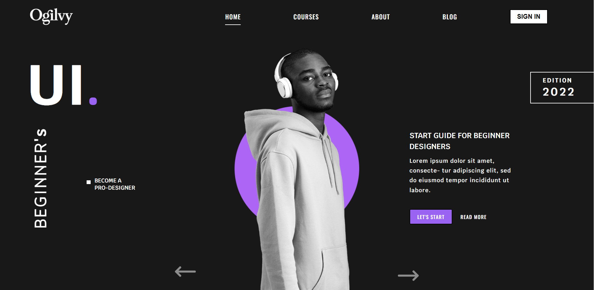

<h2 style="text-align:center; 
color: purple" >
Ogilby Test
</h2>

<h3 style="text-align:justify;"><strong>A layout practice made with react </strong></h3> 

This project was generated with 
* [Create React App](https://github.com/facebook/create-react-app).
  
* [React Icons](https://react-icons.github.io/react-icons/)
  
* [React Player](https://www.npmjs.com/package/react-player)
  
* [React Scroll](https://www.npmjs.com/search?q=slick-carousel)

* [Styled Components](https://styled-components.com/)

* [Recat Router Dom](https://tailwindcss.com/)
  
  <h2 style="text-align:center;color: purple">Repository</h2>
  *You can clone the public repository on: 

    [My Portfolio](https://github.com/carolo180/Ogilby-Test.git)

     <h2 style="text-align:center;color: purple">Deploy</h2>
  *You can check the web site: 

    [Ogilby Test](https://tiny-rugelach-3f759a.netlify.app/)
   
  * ### npm i or npm install: To install all dependices and libraries.
